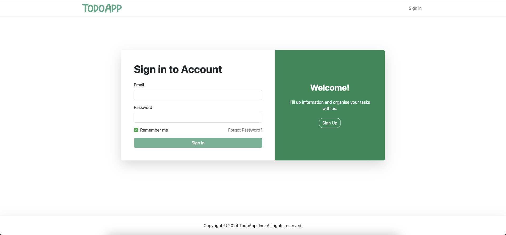

# TodoApp


## Tech Stack
- Angular v17
- Directus 10.10.5 (Backend & Authentication)
- Bootstrap v5.3

## Instalation
Requires Node.js v4+ to run. <br />
Requires Docker v23+ to run.


```sh
$ git clone https://github.com/danekkkk/TodoApp.git
$ cd directus
$ docker compose up

$ cd frontend
$ npm i
$ npm start
```

## Features
- User registration and login with full validation
- View tasks categorized as: Incompleted, Due Today, Upcoming, and Completed
- Create new tasks with fields:
    - title (string)
    - description (Markdown)
    - deadline (date >= today)
    - isImportant (true/false)
- Edit, delete, and toggle completion status of tasks

## Screenshots



